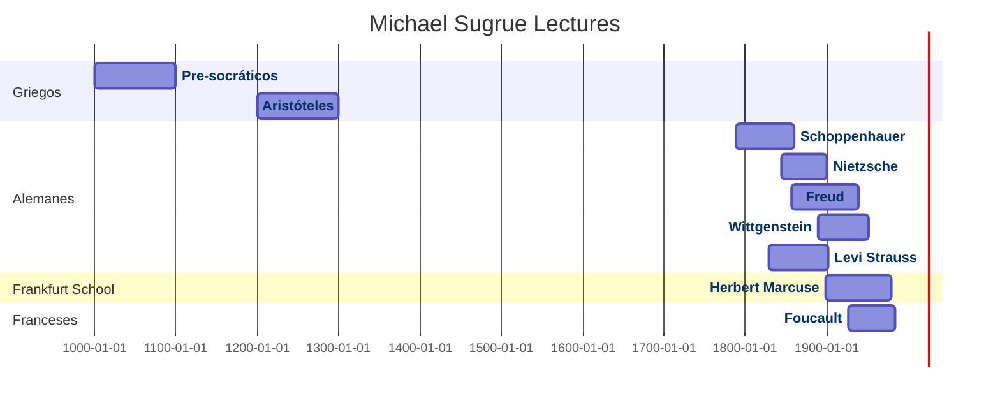

# sugrueaph
Michael Sugrue Lectures Graph

```mermaid
gantt
    dateFormat  YYYY
    title       Michael Sugrue Lectures

    section Griegos

    Pre-socráticos: ps, 1000, 1100
    click ps href " https://www.youtube.com/watch?v=eHs7owA_Na0"

    Aristóteles : ar, 1200, 1300
    click ar href "https://www.youtube.com/watch?v=8M8cedhT0qE"

    section Alemanes
    Schoppenhauer : sh, 1788, 1860
    click sh href "https://www.youtube.com/watch?v=s-Ij9EvjFeU"

    Nietzsche     : ni, 1844, 1900
    click ni href "https://www.youtube.com/watch?v=7Kuk35VNSEc"
    Freud         : fr, 1856, 1939
    click fr href "https://www.youtube.com/watch?v=OdzAQFmyxNo"
    Wittgenstein  : wi, 1889, 1951
    click wi href "https://www.youtube.com/watch?v=s-Ij9EvjFeU"
    Levi Strauss: ls, 1829, 1902
    click ls href "https://www.youtube.com/watch?v=EZ8l0Aa64-U"

    section Frankfurt School
    Herbert Marcuse: hm, 1898, 1979
    click hm href "https://www.youtube.com/watch?v=xX9EI8wEyuY"


    section Franceses
    Foucault    : fo, 1926, 1984

    click fo href "https://www.youtube.com/watch?v=KY9LwCeP7Ug"
```
